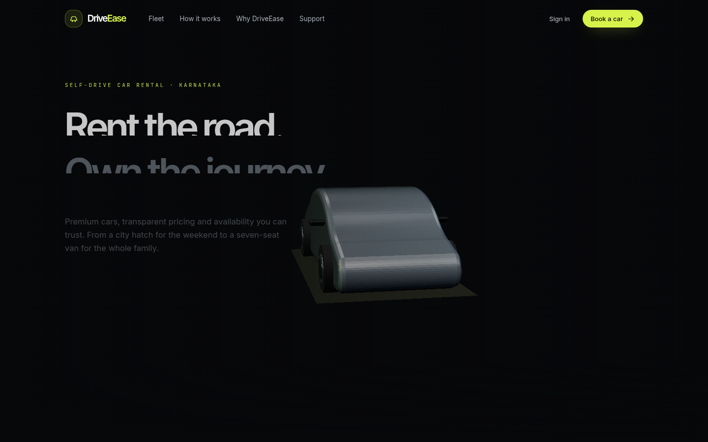
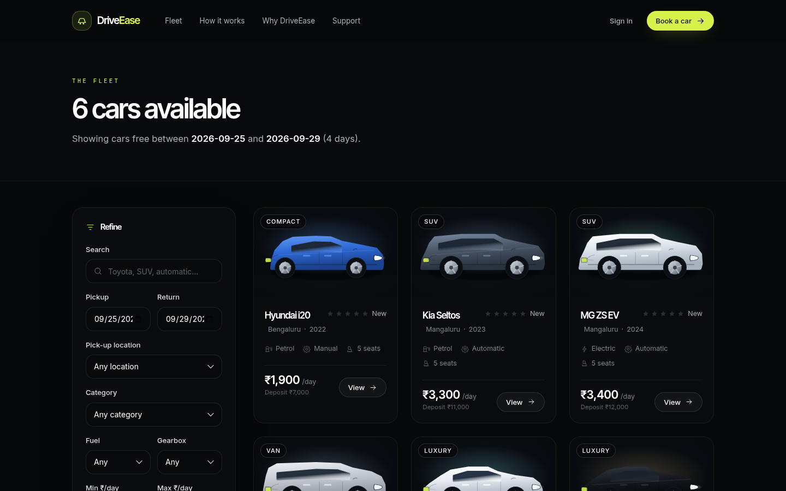
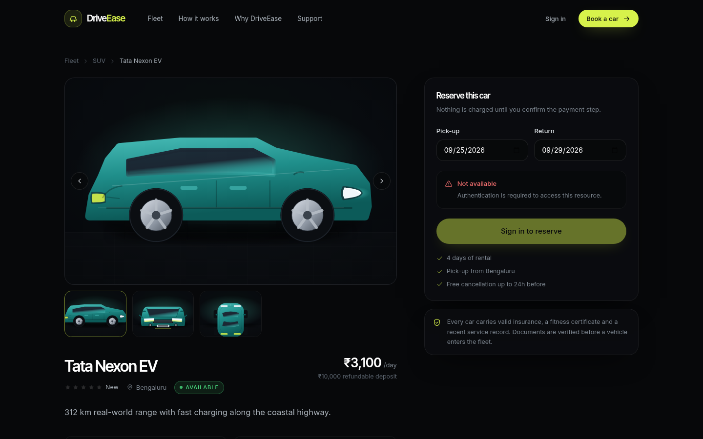
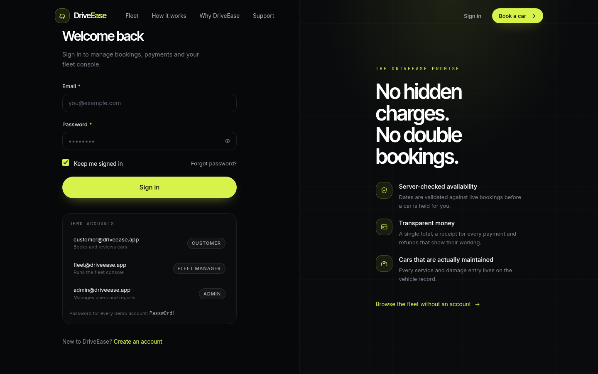
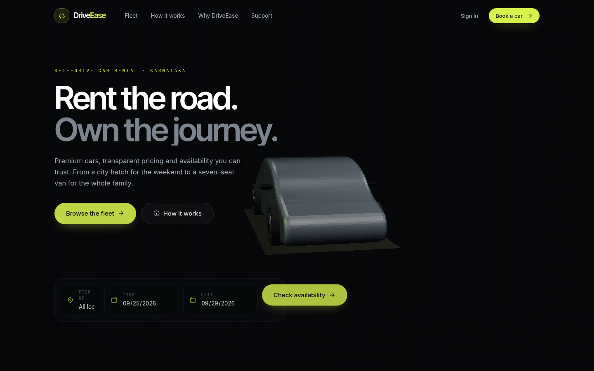

# DriveEase

**Rent the road. Own the journey.**

DriveEase is a production-style, self-drive car-rental platform: a cinematic
React + Three.js storefront and role-based consoles for customers, fleet
managers and administrators, powered by a Spring Boot 3 REST API with a
booking engine, sandbox payment gateway, refund ledger, reporting and an
audited admin surface.

> Everything in this repository was built and verified end-to-end: the backend
> suite is 50/50 green (`mvn verify`, coverage measured by JaCoCo), the
> frontend passes ESLint + 16 Vitest suites + a production build, and a
> 119-check HTTP contract sweep passes against the running stack.

---

## Feature map

**Customers**
- Register / login / refresh / logout, forgot & reset password, profile management
- Vehicle discovery with **date-based availability search**, filters (location,
  category, fuel, transmission, price), sort, pagination; detail pages with
  gallery, features, rating breakdown and upcoming availability
- Instant price quotes; bookings with overlap protection (`409` on conflict)
- Checkout with sandbox gateway (card/UPI), receipts, payment history
- Self-service cancellation with policy-based refunds
- One review per completed trip (rating, title, comment), average ratings everywhere
- In-app notifications (unread counts, mark-read)

**Fleet managers** (`/console`)
- Fleet dashboard (status mix, pickups today, utilisation)
- Vehicle CRUD with all-optional PATCH and guarded status transitions,
  retirement with reason
- Maintenance scheduling & completion (releases the vehicle back to service)
- Damage logging with severity workflow; CRITICAL damage forces maintenance
- Pickup / return workflows (mileage capture, condition tracking)
- Vehicle history timeline (trips, services, damage, status changes)

**Administrators** (`/admin`)
- User management: search/filter, create staff, activate/deactivate (audited)
- Booking & payment management, refund ledger, **partial refunds with budget enforcement**
- Revenue reports (`day | week | month | category | branch`) and utilisation
  reports — all aggregated in SQL, **never hard-coded**
- CSV exports with proper escaping
- Review moderation (soft delete, reason logged) and audit log viewer

## Tech stack

| Layer     | Choices                                                                                                       |
|-----------|---------------------------------------------------------------------------------------------------------------|
| Frontend  | React 18 (JSX only — no TypeScript), Vite 5, React Router 6, Context + hooks (no Redux), Tailwind CSS          |
| 3D / motion | Three.js via `@react-three/fiber` + `@react-three/drei`, GSAP ScrollTrigger, Lenis smooth scroll            |
| Backend   | Java 21, Spring Boot 3.2, Spring Security (JWT), Spring Data JPA/Hibernate, Flyway, Bean Validation, springdoc OpenAPI |
| Database  | PostgreSQL (14 migrations), JPA Specifications for dynamic filtering, SQL aggregation for reports              |
| Testing   | JUnit 5, Mockito, MockMvc integration tests, JaCoCo coverage, Vitest + Testing Library, ESLint                 |

## Architecture in one screen

```
React SPA (Vite, lazy routes)
  ├─ public: cinematic Home (Three.js car, scroll-choreographed), Fleet, Support
  ├─ /dashboard  customer: bookings, checkout, payments, receipts, reviews, profile
  ├─ /console    fleet manager: fleet, maintenance, damage, pickups/returns, history
  └─ /admin      admin: users, fleet, bookings, payments/refunds, reviews, reports
        │  fetch (JSON, bearer access token + HttpOnly refresh cookie)
        ▼
Spring Boot API  /api/v1   (controllers → services → repositories)
  ├─ Spring Security: JWT filter, role rules, @PreAuthorize on services
  ├─ Booking engine: state machine, pessimistic-lock overlap guard, PricingService (BigDecimal)
  ├─ PaymentGateway abstraction + SandboxPaymentGateway; RefundService ledger
  ├─ Reports: SQL aggregation (day/week/month/category/branch), utilisation math
  └─ GlobalExceptionHandler: structured JSON errors, never stack traces
        ▼
PostgreSQL — Flyway V1–V14, indexed, CHECK-constrained, audit-logged
```

Deep dives: [`docs/architecture.md`](docs/architecture.md),
[`docs/database-design.md`](docs/database-design.md),
[`docs/authentication.md`](docs/authentication.md),
[`docs/booking-engine.md`](docs/booking-engine.md),
[`docs/threejs-architecture.md`](docs/threejs-architecture.md),
[`docs/testing.md`](docs/testing.md),
[`docs/deployment.md`](docs/deployment.md),
[`docs/api-reference.md`](docs/api-reference.md).

## Database design (summary)

11 core tables (`users`, `refresh_tokens`, `password_reset_tokens`,
`vehicles`, `vehicle_images`, `bookings`, `payments`, `refunds`, `reviews`,
`maintenance_records`, `damage_records`) plus `audit_logs` and
`notifications`, managed by Flyway migrations `V1–V14` (append-only — applied
migrations are never edited). Money is `NUMERIC(10,2)` mapped to `BigDecimal`;
statuses are CHECK-constrained enums; booking/payment keys are indexed for the
reporting aggregations; a `v_booking_revenue` view powers net-revenue queries.

## Authentication

Stateless JWT (HS256, configurable expiry) + **rotating refresh token in an
HttpOnly/Secure/SameSite=Lax cookie** scoped to `/api/v1/auth`. Refresh-token
families implement reuse detection: replaying a rotated token revokes the
whole family. Passwords are BCrypt-hashed (DelegatingPasswordEncoder); reset
tokens are hashed, single-use and expiring. Role rules are enforced twice:
route-level in `SecurityConfig` and method-level `@PreAuthorize`; the frontend
checks roles for UX only — the API is the authority.
See [`docs/authentication.md`](docs/authentication.md).

## Booking engine

`PENDING → (payment SUCCESS) → CONFIRMED → (pickup) ACTIVE → (return) COMPLETED`,
with `CANCELLED` (policy refund) reachable while pending/confirmed. Windows are
half-open (`[pickup, return)`); overlap checks run under `PESSIMISTIC_WRITE`
in the creation transaction, so double-booking is impossible — conflicts get
`409 VEHICLE_NOT_AVAILABLE` with nothing persisted. Pricing is
`days × dailyRate + refundable deposit` in `BigDecimal`, snapshotted at
creation. Vehicles move `AVAILABLE → RENTED` at pickup and back on return.
Details and the refund policy table: [`docs/booking-engine.md`](docs/booking-engine.md).

## Payments & refunds

A `PaymentGateway` abstraction with a deterministic `SandboxPaymentGateway`
(declines on amount > threshold, card last-4 `0000`, UPI handle containing
`fail`). Attempts are recorded (success *and* decline) with references
`DE-PAY-…`/`DE-TXN-…` and receipts `RCPT-<ref>`. Refunds (`DE-RF-…`) support
partial amounts, cap at 100 % of the original, block duplicate cancellation
refunds and record the acting admin. **No real money moves; card numbers and
CVV are never accepted or stored** — the DTO contract rejects PAN/CVV fields.

## 3D architecture

The homepage hero is a real WebGL scene: an original procedural car
(`src/three/CarModel.jsx` — no licensed assets), studio lighting with a
PMREM-baked `RoomEnvironment`, scroll-driven camera + car choreography with
damped interpolation (`CarScrollController`, `CarCamera`), one shared rAF loop
between Lenis and GSAP ScrollTrigger, `IntersectionObserver`-gated frameloops,
pixel-ratio caps, full disposal on unmount, `prefers-reduced-motion` static
frames, and a static fallback when WebGL is unavailable.
Details: [`docs/threejs-architecture.md`](docs/threejs-architecture.md).

## Performance

- Route-level code splitting; the Three.js bundle is its own lazy chunk
  (three ≈ 810 kB raw / 219 kB gzip, loaded only on the marketing pages).
- Server-side filtering/pagination everywhere (Specifications + `Pageable`);
  reports aggregate in SQL; per-page rating/count/covers lookups are batched
  (no N+1).
- Images are optimised local SVGs, `loading="lazy"`, `object-fit` contained,
  with graceful fallbacks.
- 3D: quality tiers by device capability, dpr caps, render pause off-screen,
  adaptive DPR, single rAF owner.

## Testing & verification

| Gate                        | Command                | Latest verified result                          |
|-----------------------------|------------------------|-------------------------------------------------|
| Backend suite               | `mvn verify`           | **50/50 green** (18 unit + 32 integration)      |
| Backend coverage (JaCoCo)   | `target/site/jacoco/`  | **LINE 65.9 %**, BRANCH 37.3 % (measured, 0.8.12) |
| Frontend lint               | `npm run lint`         | 0 problems                                      |
| Frontend tests              | `npm test`             | 16/16 green                                     |
| Frontend production build   | `npm run build`        | success (~8.5 s)                                |
| HTTP contract sweep         | dev-time script        | **119/119 checks pass** on the running stack    |

`docs/testing.md` lists every suite and what it proves.

## Local setup

Prerequisites: JDK 21, Maven 3.9+, Node 20+, PostgreSQL 14+.

```bash
# 1. Database
createdb driveease                      # credentials via env (see below)

# 2. Backend (dev profile migrates + seeds demo data)
cd backend
mvn spring-boot:run                     # http://localhost:8080

# 3. Frontend
cd frontend
npm ci
npm run dev                             # http://localhost:5173 (proxies /api → :8080)
```

Swagger UI: <http://localhost:8080/swagger-ui.html> ·
OpenAPI JSON: `/api/v3/api-docs` · Health: `/actuator/health`.

### Demo credentials (seeded, password `Passw0rd!` for all)

| Role          | Email                    |
|---------------|--------------------------|
| Admin         | `admin@driveease.app`    |
| Fleet manager | `fleet@driveease.app`    |
| Customer      | `customer@driveease.app` |
| Customer      | `priya@driveease.app`    |

### Environment variables

Copy `backend/.env.example` and `frontend/.env.example`. Key knobs:

| Variable                                      | Purpose                                        |
|-----------------------------------------------|------------------------------------------------|
| `DB_URL` / `DB_USERNAME` / `DB_PASSWORD`      | PostgreSQL connection                          |
| `JWT_SECRET`, `JWT_ACCESS_EXPIRATION`, `JWT_REFRESH_EXPIRATION` | Token signing & lifetimes    |
| `COOKIE_SECURE` / `COOKIE_SAME_SITE` / `COOKIE_DOMAIN` | Refresh-cookie posture                |
| `FRONTEND_URL` / `APP_BASE_URL`               | CORS + links                                   |
| `PAYMENT_GATEWAY_MODE`                        | `SANDBOX` \| `ALWAYS_SUCCEED` \| `ALWAYS_FAIL` |
| `EMAIL_PROVIDER` / `EMAIL_FROM`               | `mock` (dev) or SMTP provider settings         |
| `SEED_DEMO_DATA`                              | `true` only for local/demo databases           |
| `VITE_API_BASE_URL` (frontend)                | API base for production builds                 |

**No secrets are committed** — production values come from the environment.

### Migrations

Flyway runs on every boot. To evolve the schema, add
`db/migration/V15__your_change.sql`; editing an applied migration fails
checksum validation by design. `ddl-auto` never leaves `validate` in prod.

## API documentation

Human reference: [`docs/api-reference.md`](docs/api-reference.md) ·
Machine doc: `/v3/api-docs` (OpenAPI 3) · Swagger UI at `/swagger-ui.html`.

## Deployment

Verified paths and the full runbook (managed PostgreSQL → Spring Boot JAR →
Vercel SPA, env vars, SPA fallback, health probes):
[`docs/deployment.md`](docs/deployment.md).

**Live app:** not deployed from this workspace — the verified runtime here is
local (frontend `:5173`, API `:8080`, both exercised by the contract sweep).
The repository is deployment-ready as documented.

## Screenshots

| | |
|---|---|
|  |  |
| `home.png` — cinematic hero with the 3D car | `fleet.png` — live availability search |
|  |  |
| `vehicle-detail.png` — gallery, specs, booking panel | `login.png` — the auth experience |
|  |  |
| `how-it-works.png` — scroll-choreographed narrative section |  |

## Project layout

```
driveease/
├── backend/
│   ├── pom.xml                          Spring Boot 3.2.5, JaCoCo, Failsafe
│   └── src/
│       ├── main/java/com/driveease/     controller · service · repository(+spec)
│       │                                dto · entity · mapper · security · config
│       │                                exception · util · bootstrap
│       ├── main/resources/              application{,-dev,-prod}.yml, db/migration V1–V14
│       └── test/                        unit (Pricing, BookingService) + IT (lifecycle,
│                                        auth/access, reporting/fleet) + application-test.yml
├── frontend/
│   ├── package.json / vite.config.js    Vitest, proxy, allowedHosts, manualChunks
│   └── src/
│       ├── api/  context/  hooks/       fetch client, Auth/Toast contexts, utilities
│       ├── three/  animations/          3D scene + Lenis/GSAP choreography
│       ├── components/                  ui/ design system, layout, vehicles, booking
│       ├── pages/                       public · auth · customer · console · admin
│       └── test/                        Vitest suites
├── docs/                                8 deep-dive documents + screenshots/
├── .editorconfig
└── README.md
```

## Future improvements

- Swap the sandbox gateway for Stripe/Razorpay behind the same interface
  (webhooks for async settlement).
- Real geolocation for branches, dynamic pricing seasons, add-on extras.
- Notification e-mail digests; push via service workers.
- Playwright end-to-end journeys over the deployed app; k6 load profile on the
  booking hot path.
- CDN-hosted GLB car models with DRACO compression and multiple vehicle
  hero scenes per category.

## License

© 2026 DriveEase. Educational portfolio project — the sandbox payment
gateway moves no real money.
